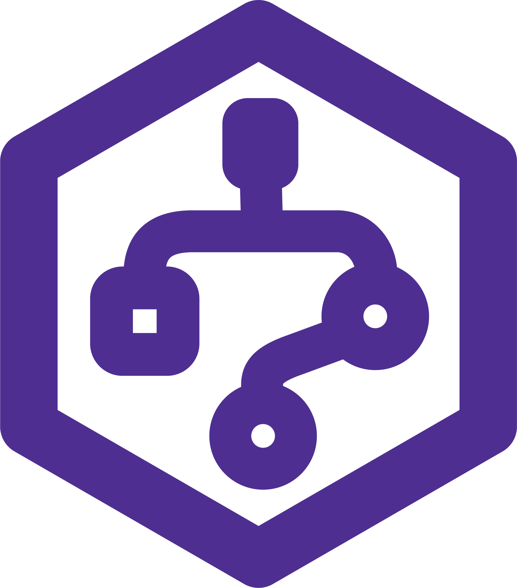

# spaq - AI-Powered Decision Intelligence Platform

<div align="center">
  

<h3>Transform your team's decisions into searchable, actionable intelligence</h3>

  [](https://nextjs.org/)
  [](https://www.typescriptlang.org/)
  [](https://tailwindcss.com/)
  [](LICENSE)

</div>

## 🚀 Overview

spaq is a decision intelligence platform that captures, connects, and learns from every choice your team makes. By integrating with your existing tools, spaq builds a searchable knowledge graph of decisions, ensuring critical insights are never lost.

## ✨ Features

- **🧠 AI-Powered Intelligence**: Advanced ML models that learn from your team's decision patterns
- **🔍 Smart Search**: Natural language queries to find past decisions instantly
- **🔗 Knowledge Graphs**: Visual representation of decision chains and their outcomes
- **🔌 Seamless Integrations**: Works with Slack, Teams, Notion, and more
- **📊 Analytics Dashboard**: Track decision velocity, participation, and impact
- **🔒 Enterprise Security**: SOC 2 compliant with end-to-end encryption
- **🌐 Multi-Platform**: Web app, REST API, and native SDKs

## 🛠️ Tech Stack

- **Frontend**: Next.js 15, React 18, TypeScript
- **Styling**: Tailwind CSS, Framer Motion
- **UI Components**: Custom components with Radix UI primitives
- **Authentication**: NextAuth.js (ready for integration)
- **Deployment**: Optimized for Vercel

## 📦 Installation

```bash
# Clone the repository
git clone https://github.com/spaq-ai/spaq.git
cd spaq-frontend

# Install dependencies
npm install

# Run development server
npm run dev

# Build for production
npm run build

# Start production server
npm start
```

## 🔧 Environment Variables

Create a `.env.local` file in the root directory:

```env
# API Configuration
NEXT_PUBLIC_API_URL=https://api.spaq.ai
NEXT_PUBLIC_APP_URL=https://spaq.ai

# Authentication (when ready)
NEXTAUTH_URL=http://localhost:3000
NEXTAUTH_SECRET=your-secret-key

# Optional: Analytics
NEXT_PUBLIC_GA_ID=your-google-analytics-id
```

## 📁 Project Structure

```
spaq-frontend/
├── src/
│   ├── app/                 # Next.js app router pages
│   │   ├── (auth)/         # Authentication pages
│   │   ├── (dashboard)/    # Dashboard pages
│   │   ├── (legal)/        # Public pages (docs, pricing, etc.)
│   │   └── page.tsx        # Landing page
│   ├── components/         # Reusable components
│   │   ├── ui/            # UI components
│   │   └── charts/        # Chart components
│   ├── lib/               # Utility functions
│   └── styles/            # Global styles
├── public/                 # Static assets
│   └── images/            # Images and icons
└── package.json           # Dependencies
```

## 🚀 Deployment

### Deploy to Vercel

[](https://vercel.com/new/clone?repository-url=https://github.com/yourusername/spaq-frontend)

1. Click the button above or go to [vercel.com](https://vercel.com)
2. Import your GitHub repository
3. Configure environment variables
4. Deploy!

### Manual Deployment

```bash
# Build the application
npm run build

# The build output will be in .next/
# Deploy this to any Node.js hosting platform
```

## 📱 Features by Page

- **Landing Page**: Hero, features, use cases, pricing preview
- **Dashboard**: Decision tracking, analytics, AI insights
- **Documentation**: API reference, SDKs, guides
- **Pricing**: Detailed pricing tiers and comparison
- **Blog**: Product updates and insights
- **Security**: Compliance and security information
- **Contact**: Sales inquiries and support

## 🎨 Customization

### Colors

Edit `tailwind.config.js` to customize the color scheme:

```js
colors: {
  primary: {
    DEFAULT: '#5B21B6',  // Purple
    light: '#8B5CF6',
    dark: '#4C1D95',
  },
  // ... other colors
}
```

### Components

All UI components are in `src/components/ui/` and can be customized.

## 🧪 Testing

```bash
# Run tests (when implemented)
npm test

# Run linting
npm run lint

# Type checking
npm run type-check
```

## 📈 Performance

- Lighthouse Score: 95+ (Performance)
- First Contentful Paint: < 1.5s
- Time to Interactive: < 3.5s
- Optimized images with Next.js Image component
- Code splitting and lazy loading

## 🤝 Contributing

1. Fork the repository
2. Create your feature branch (`git checkout -b feature/amazing-feature`)
3. Commit your changes (`git commit -m 'Add amazing feature'`)
4. Push to the branch (`git push origin feature/amazing-feature`)
5. Open a Pull Request

## 📄 License

This project is licensed under the MIT License - see the [LICENSE](LICENSE) file for details.

## 🙏 Acknowledgments

- Built with [Next.js](https://nextjs.org/)
- UI components inspired by [shadcn/ui](https://ui.shadcn.com/)
- Animations powered by [Framer Motion](https://www.framer.com/motion/)

## 📞 Support

- Documentation: [docs.spaq.ai](https://docs.spaq.ai)
- Email: support@spaq.ai
- Twitter: [@spaq_ai](https://twitter.com/spaq_ai)

---

<div align="center">
  Made with ❤️ by the spaq team
</div>
